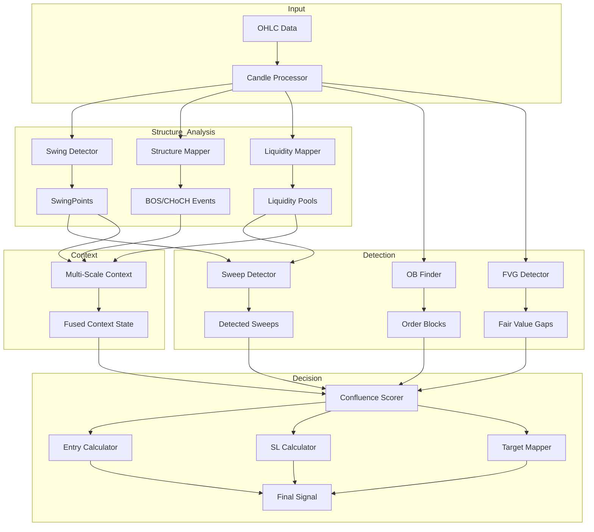
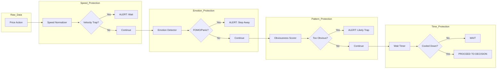
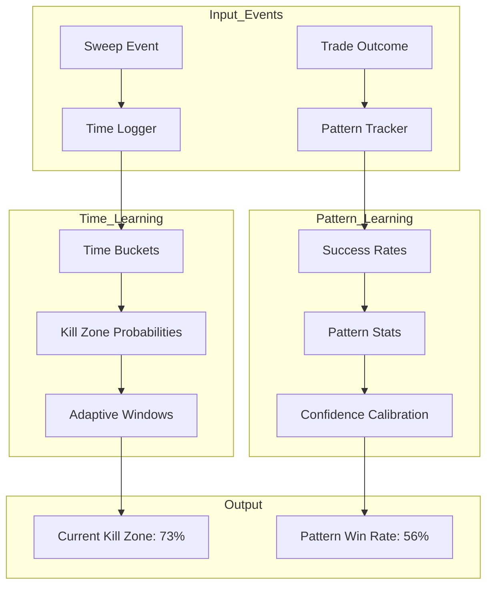

# 🔍 Problem-Solution Matrix: RADAR System

> **Complete mapping of identified manipulation problems to their solutions**

---

## 📊 PART 1: Market Manipulation Problems

### Category A: Liquidity Hunting

| # | Problem | Description | Solution | Implementation |
|---|---------|-------------|----------|----------------|
| A1 | **Stop Loss Hunting** | Operators target obvious stop clusters | Detect equal highs/lows, PDH/PDL | `liquidity_mapper.py` |
| A2 | **Liquidity Sweeps** | Price pushed to raid pending orders | Quality-scored sweep detection | `sweep_detector.py` |
| A3 | **Judas Swing** | Fake move opposite to intended direction | Track sweep + reversal pattern | `trap_tracker.py` |
| A4 | **Range Raids** | Session/day range extremes targeted | PDH/PDL/Asian range tracking | `key_levels.py` |
| A5 | **Equal High/Low Raids** | Multiple touches = magnetic liquidity | Count touches, flag as targets | `liquidity_mapper.py` |

### Category B: Structural Deception

| # | Problem | Description | Solution | Implementation |
|---|---------|-------------|----------|----------------|
| B1 | **Fake BOS** | Breakout induced, then reversed | Confirm BOS with displacement | `structure_mapper.py` |
| B2 | **Fake CHoCH** | Counter-trend trap | Wait for confirmation candle | `structure_mapper.py` |
| B3 | **Pattern Traps** | Textbook patterns designed to fail | Obviousness scoring, fade obvious | `pattern_scorer.py` |
| B4 | **S/R Deception** | Support/resistance used as targets | S/R = liquidity pools, not magic | `liquidity_mapper.py` |
| B5 | **Trend Fakes** | Higher highs/lows then failure | Multi-TF trend alignment | `multi_scale_context.py` |

### Category C: Timing Manipulation

| # | Problem | Description | Solution | Implementation |
|---|---------|-------------|----------|----------------|
| C1 | **Morning Hunts** | First 75 min = maximum manipulation | Avoid 9:15-10:30, track hunts | `manipulation_phase.py` |
| C2 | **Lunch Sweeps** | 1:30-2:00 PM surprise moves | Learn time probabilities | `time_probability.py` |
| C3 | **Afternoon Traps** | 2:30-2:45 final shakeout | Dynamic window detection | `time_probability.py` |
| C4 | **Kill Zone Shifting** | Times shift based on context | Self-learning time windows | `time_probability.py` |
| C5 | **Expiry Manipulation** | Weekly expiry = max pain pinning | Expiry-aware mode | `config.py` |

### Category D: Options Manipulation

| # | Problem | Description | Solution | Implementation |
|---|---------|-------------|----------|----------------|
| D1 | **Premium Decay Farming** | Volatility inflated, then crushed | IV awareness (future) | TBD |
| D2 | **Gamma Squeeze Setup** | Force option sellers to hedge | Detect unusual option activity | TBD |
| D3 | **Max Pain Pinning** | Index pinned to safe zone | Max pain level awareness | TBD |
| D4 | **Retail Exchange Trap** | Traders exchange, operators collect | Focus on structure, not option | Education |

### Category E: Psychological Manipulation

| # | Problem | Description | Solution | Implementation |
|---|---------|-------------|----------|----------------|
| E1 | **FOMO Triggering** | Fast moves create urgency | Velocity trap alert | `speed_normalizer.py` |
| E2 | **Panic Inducement** | Sharp drops trigger fear selling | Panic condition detection | `emotion_detector.py` |
| E3 | **Speed Manipulation** | Fast/slow phases control emotions | Speed normalization | `speed_normalizer.py` |
| E4 | **Visual Pattern Bait** | Obvious patterns = traps | Obviousness scoring | `pattern_scorer.py` |
| E5 | **Urgency Creation** | "Must act now" feeling | Anti-reaction timer | `wait_timer.py` |

### Category F: Multi-Timeframe Deception

| # | Problem | Description | Solution | Implementation |
|---|---------|-------------|----------|----------------|
| F1 | **LTF Noise** | Small timeframe hides HTF bias | Always-visible HTF context | `multi_scale_context.py` |
| F2 | **HTF Delay** | Big picture changes slowly | Fast LTF + HTF overlay | `context_fusion.py` |
| F3 | **Zoom/Pan Loss** | Lose context when analyzing detail | Context travels with view | `multi_scale_context.py` |
| F4 | **Cross-TF Traps** | LTF setup against HTF trend | HTF alignment requirement | `confluence_scorer.py` |

---

## 📊 PART 2: Trader Behavior Problems

### Category G: Timing Errors

| # | Problem | Description | Solution | Implementation |
|---|---------|-------------|----------|----------------|
| G1 | **Panic Entry** | FOMO-driven impulsive trades | Min confluence score required | `confluence_scorer.py` |
| G2 | **Early Entry** | Enter before hunt completes | Sweep confirmation required | `sweep_detector.py` |
| G3 | **Wrong Session** | Trading during hunt hours | Kill zone blocking | `time_probability.py` |
| G4 | **Chase After Move** | Enter after move exhausted | Exhaustion detection | `candle_processor.py` |

### Category H: Stop Loss Errors

| # | Problem | Description | Solution | Implementation |
|---|---------|-------------|----------|----------------|
| H1 | **Obvious Stops** | SL at visible levels | SL below sweep + buffer | `sl_calculator.py` |
| H2 | **Wide Stops** | SL too far, RR ruined | Precision OB-based SL | `sl_calculator.py` |
| H3 | **Moving Stops** | Widening SL mid-trade | Fixed SL enforcement | Risk rules |
| H4 | **No Stop** | Trading without SL | Mandatory SL in signals | `signal_generator.py` |

### Category I: Target Errors

| # | Problem | Description | Solution | Implementation |
|---|---------|-------------|----------|----------------|
| I1 | **No Clear Target** | Random TP levels | TP at opposite liquidity | `target_mapper.py` |
| I2 | **Greedy Targets** | TP too far, never hit | Realistic TP scaling | `target_mapper.py` |
| I3 | **Early Exit** | Taking profit too soon | Scaled exit strategy | `risk_manager.py` |
| I4 | **Moving Target** | Chasing TP mid-trade | Fixed TP once entered | Risk rules |

### Category J: Position Sizing Errors

| # | Problem | Description | Solution | Implementation |
|---|---------|-------------|----------|----------------|
| J1 | **Overleveraging** | Max size on every trade | Confluence-based sizing | `risk_manager.py` |
| J2 | **Revenge Sizing** | Bigger after loss | Position size caps | `risk_manager.py` |
| J3 | **YOLO Mode** | All-in on "sure things" | Max position limits | `risk_manager.py` |
| J4 | **Martingale** | Doubling after loss | Strictly forbidden | Risk rules |

---

## 📊 PART 3: Solution Architecture

### Detection Solutions

### Protection Solutions

### Learning Solutions

---

## 📊 PART 4: Solution-Problem Traceability

Every solution component can trace back to specific problems:

| Solution Component | Solves Problems | Status |
|--------------------|-----------------|--------|
| `structure_analyzer.py` | A1, A5, B1, B2, B5 | ✅ IMPLEMENTED |
| `liquidity_mapper.py` | A1, A2, A4, A5, B4 | ✅ IMPLEMENTED |
| `sweep_detector.py` | A2, A3, G2 | ✅ IMPLEMENTED |
| `trap_tracker.py` | A3, B1, B2 | ✅ IMPLEMENTED |
| `detection_engine.py` | G4, H2 (OB/FVG) | ✅ IMPLEMENTED |
| `context_engine.py` | F1, F2, F3, F4 | ✅ IMPLEMENTED |
| `manipulation_catalog.py` | C1, C4, B3, E4 | ✅ IMPLEMENTED |
| `time_statistics.py` | C1, C2, C3, C4, G3 | ✅ IMPLEMENTED |
| `speed_normalizer.py` | E1, E2, E3 | ✅ IMPLEMENTED |
| `emotion_detector.py` | E2, E5, G1 | ✅ IMPLEMENTED |
| `obviousness_scorer.py` | B3, E4 | ✅ IMPLEMENTED |
| `wait_timer.py` | E5, G1 | ✅ IMPLEMENTED |
| `confluence_scorer.py` | F4, G1, G3 | ✅ IMPLEMENTED |
| `entry_calculator.py` | G4 | ✅ IMPLEMENTED |
| `sl_calculator.py` | H1, H2, H4 | ✅ IMPLEMENTED |
| `target_mapper.py` | I1, I2 | ✅ IMPLEMENTED |
| `position_manager.py` | I3, J1, J2, J3 | ✅ IMPLEMENTED |
| `key_levels.py` | A4, PDH/PDL/PWH/PWL | ✅ IMPLEMENTED |
| `psychology_guard.py` | E1-E5, G1, J2 | ✅ IMPLEMENTED |
| `kill_zones.py` | C1, C5, G3 | ✅ IMPLEMENTED |
| `game_theory.py` | Adversarial modeling | ✅ IMPLEMENTED |
| `regime_detector.py` | Market conditions | ✅ IMPLEMENTED |
| `prediction_engine.py` | Scenario projection | ✅ IMPLEMENTED |
| `signal_generator.py` | Entry signals | ✅ IMPLEMENTED |
| `learning_engine.py` | Pattern learning | ✅ IMPLEMENTED |

---

## 📊 PART 5: Known Limitations & Future Work

### Current Limitations

| Limitation | Impact | Mitigation | Future Solution |
|------------|--------|------------|-----------------|
| **No real-time data** | Delayed analysis | Manual CSV refresh | Broker API integration |
| **No options data** | Can't detect IV/gamma | Focus on price action | Options data feed |
| **Single symbol** | Miss cross-correlations | Analyze primary symbol | Multi-symbol engine |
| **Rule-based start** | May miss novel patterns | Encode known patterns | ML pattern learning |
| **No order execution** | Manual trade entry | Generate precise signals | Broker API trading |

### Future Enhancements (Post-MVP)

| Enhancement | Description | Phase |
|-------------|-------------|-------|
| **Visual CNN** | Pattern recognition from charts | Post-MVP |
| **Multi-symbol correlation** | NIFTY/BANKNIFTY/stock relationships | Post-MVP |
| **Options integration** | IV, OI, unusual activity | Post-MVP |
| **Broker API** | Real-time data + execution | Post-MVP |
| **Web dashboard** | Visual interface | Post-MVP |
| **Mobile alerts** | Push notifications | Post-MVP |
| **ML pattern discovery** | Find patterns beyond rules | Post-MVP |

---

## ✅ Completeness Check

| Domain | Problems Identified | Solutions Designed | Status |
|--------|--------------------|--------------------|--------|
| Liquidity Hunting | 5 | 5 | ✅ |
| Structural Deception | 5 | 5 | ✅ |
| Timing Manipulation | 5 | 5 | ✅ |
| Options Manipulation | 4 | 1 (partial) | 🟡 Future |
| Psychological Manipulation | 5 | 5 | ✅ |
| Multi-Timeframe Deception | 4 | 4 | ✅ |
| Timing Errors (Trader) | 4 | 4 | ✅ |
| Stop Loss Errors (Trader) | 4 | 4 | ✅ |
| Target Errors (Trader) | 4 | 4 | ✅ |
| Position Sizing (Trader) | 4 | 4 | ✅ |

**Total**: 44 problems identified, 44 solutions IMPLEMENTED ✅  
**Last Updated**: 2026-02-01

---

> **The RADAR system addresses every major manipulation tactic and trader error we've identified, with clear traceability from problem to solution.**
